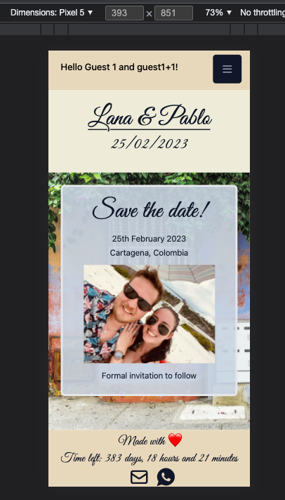
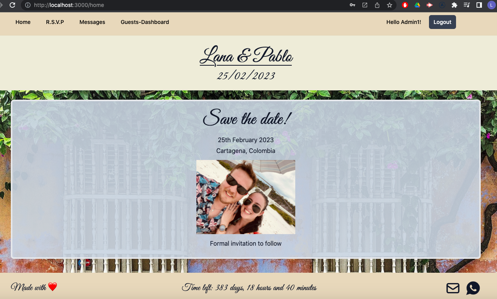
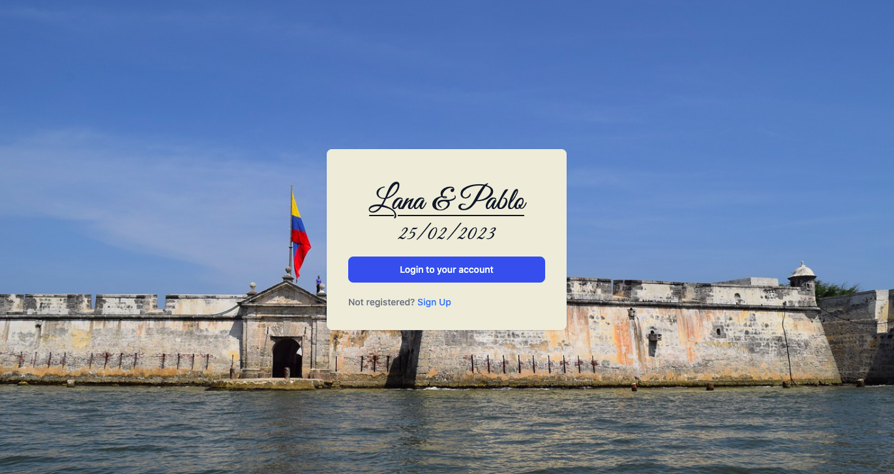
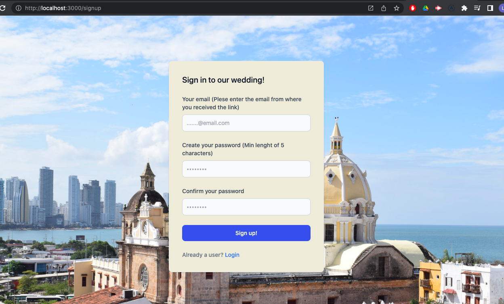
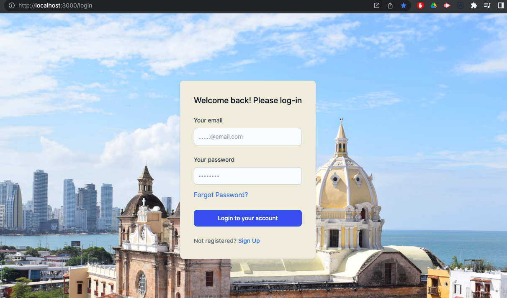
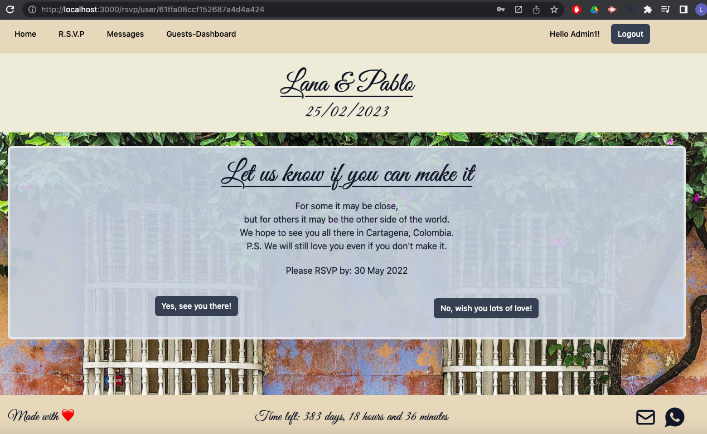
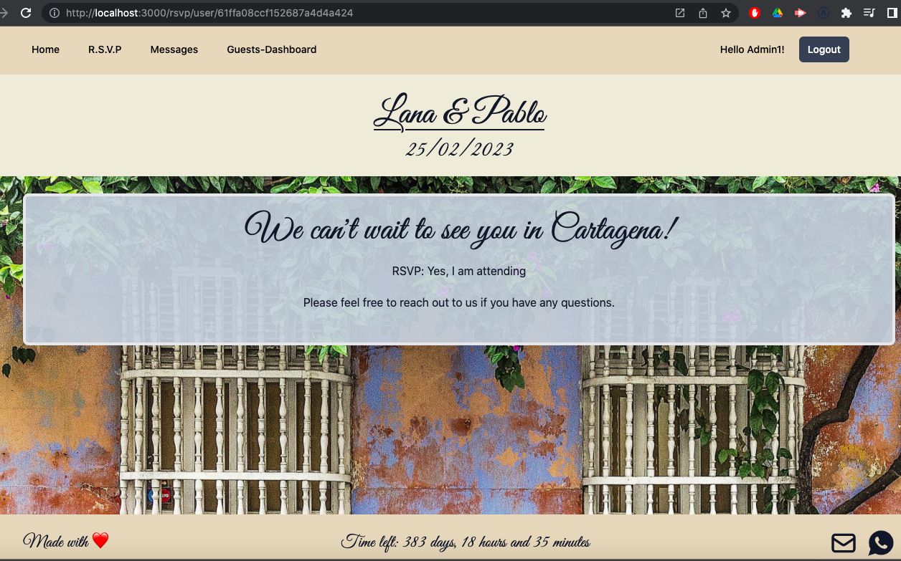
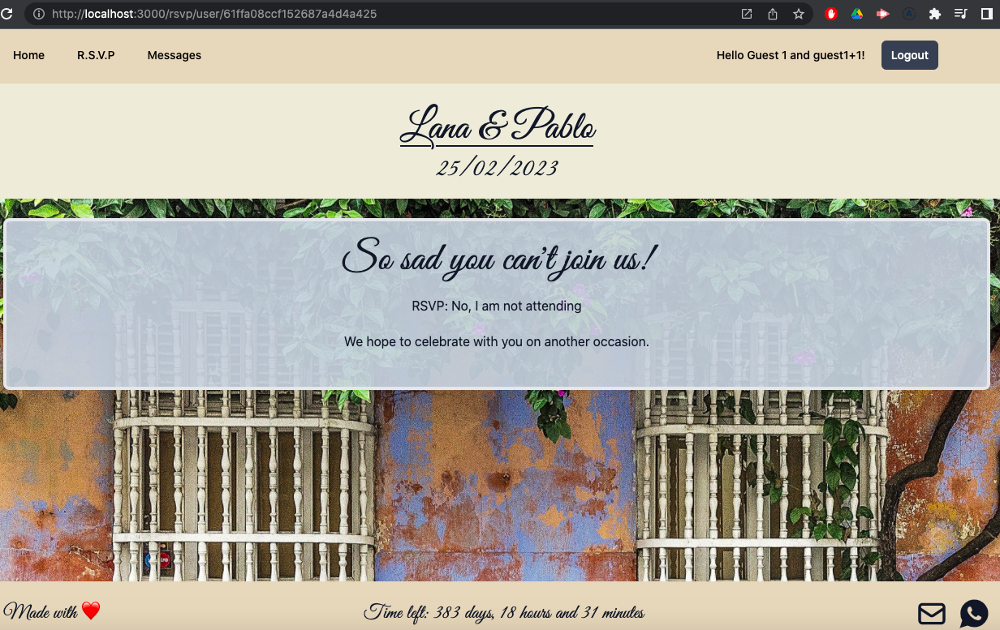
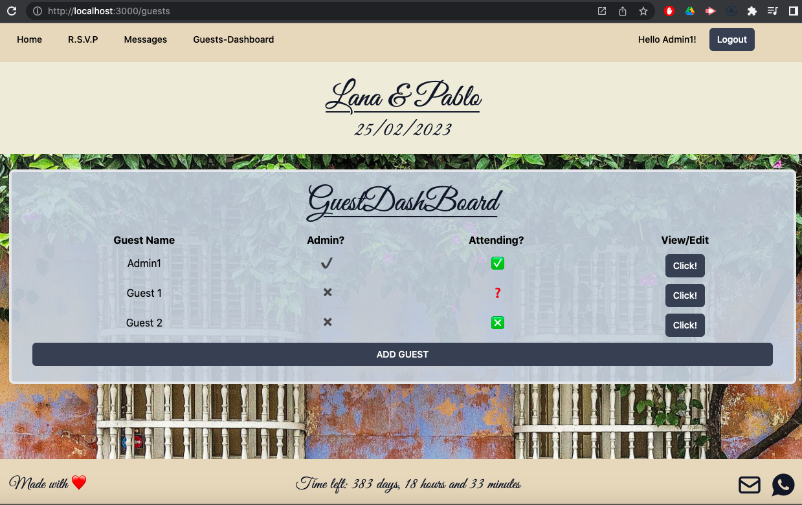

# README - WEDDING APP

[](https://opensource.org/licenses/MIT)

## Link to see the deployed application:

[DEPLOYED APPLICATION](https://lana-pablo-wedding.herokuapp.com/)

## Description

This is a responsive MERN (MongoDb, Express, React and Node.Js) application, this application allows people planing their weddings to share all the information about the wedding to their guests, it has a functionality for the guest to RSVP and send messages to the administrators. As an administrator user you can add guests, see who will be attending at the wedding and who doesn't and reply to the messages.

Application is responsive to various screen size:

Mobile:



Desktop:



Packages/libraries used for this application:
[Apollo Client](https://www.apollographql.com/docs/react/)  
[Apollo-server-express](https://www.npmjs.com/package/apollo-server-express)  
[Bcrypt](https://www.npmjs.com/package/bcrypt)  
[date-fns](https://date-fns.org/)  
[dotenv](https://www.npmjs.com/package/dotenv)  
[Express](https://www.npmjs.com/package/express)  
[Express-session](https://www.npmjs.com/package/express-session)  
[GraphQL](https://graphql.org/)  
[jwt-decode](https://www.npmjs.com/package/jwt-decode)  
[Jsonwebtoken](https://www.npmjs.com/package/jsonwebtoken)  
[Moongose](https://mongoosejs.com/)  
[Nodemailer](https://nodemailer.com/about/)  
[React](https://reactjs.org/)  
[React-contdown](https://www.npmjs.com/package/react-countdown)  
[React-dom](https://www.npmjs.com/package/react-dom)
[React-icons](https://react-icons.github.io/react-icons/)  
[React-router-dom](https://reactrouter.com/web/guides/quick-start)  
[tailwindcss](https://tailwindcss.com/)

## Table of contents:

1. [Installation](#installation)
2. [Usage](#usage)
3. [License](#license)
4. [Contributing](#contributing)
5. [Collaborators & Questions](#Collaborators/Questions)

## Installation

1. Fork repository
2. Clone repository to local environment.
3. Node.js must be installed.
4. To install all the dependencies use the following command in the root folder:

```bash
npm install
```

5. You will need to create a .env file with the following variables:

```bash
SECRET=
//For the set up of Nodemailer (depending on your domain you will need to do take additional sterps, below is for Gmail configuration)
REACT_APP_EMAIL=
REACT_APP_EMAIL-PASS=
OAUTH_CLIENTID=
OAUTH_CLIENT_SECRET=
OAUTH_REFRESH_TOKEN=
```

6. Seed the database (you must create an admin user):

```bash
npm run seed
```

7. To run the application in development:

```bash
npm run develop
```

## Usage

User will land on the landing page:



If it is a new user by clicking on 'Sign Up' it will be redirected to the Sign Up page to register:



If the user has an account already by clicking on the 'Login to your account' it will be redirected to the Login page:



If the user forgot the his password by clicking the forgot password a link will be sent to the registered email address with a link to reset the password.

Once the user Login it will be redirected to the home page, where the the information of the wedding will be displayed (save the date, invitation, all the details). In the nav bar if the user is as administrator the option 'Guest-Dashboard' will be displayed:


The RSVP tab as a default will give the option to the user to mark yes or no:



If the user marked yes RSVP tab will change to show his response, same as if it marked no:





The guest dashboard shows the guest list, if they are admin and if they are attending. The admin can add guests and view and edit the current guests:



\*\*Messages tab is under development

## License

This project is covered under the MIT license.

## Contributing

When contributing to this repository, please first discuss the change you wish to make via issue, email, or any other method with the owners of this repository before making a change.
Please note we have a code of conduct, please follow it in all your interactions with the project.
Contributions follow the [Contributor Convenant](http://contributor-covenant.org/version/1/4/).

## Questions

[GitHub profile](http://github.com/PFZM)

[Contact Me - Email](mailto:pfzm@hotmail.com)
